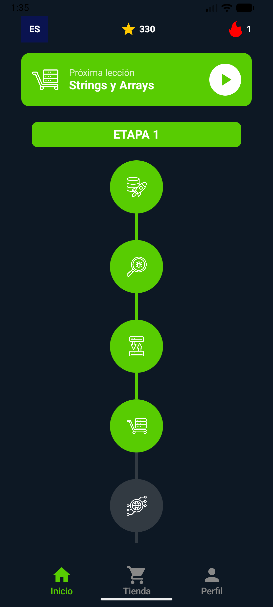
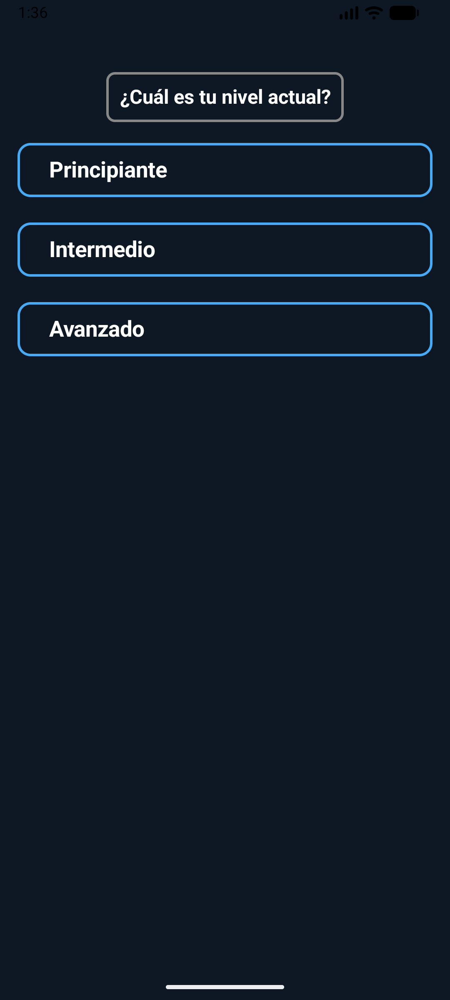
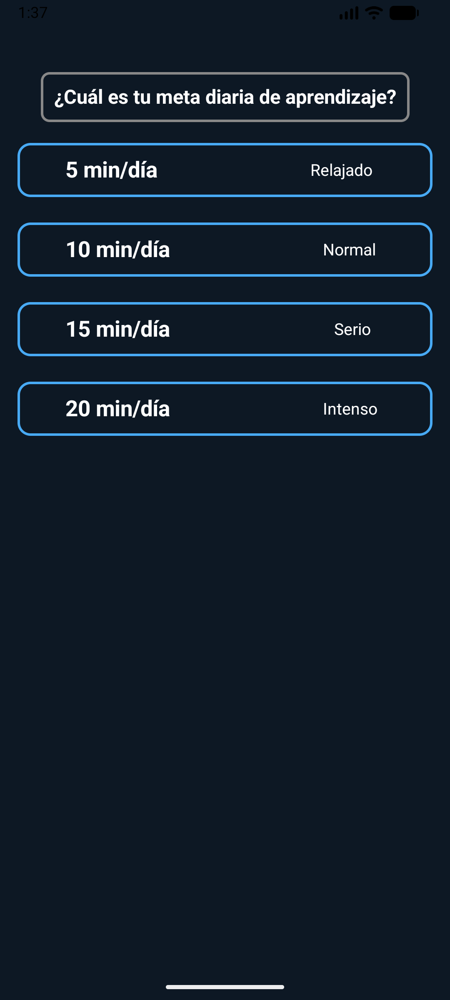
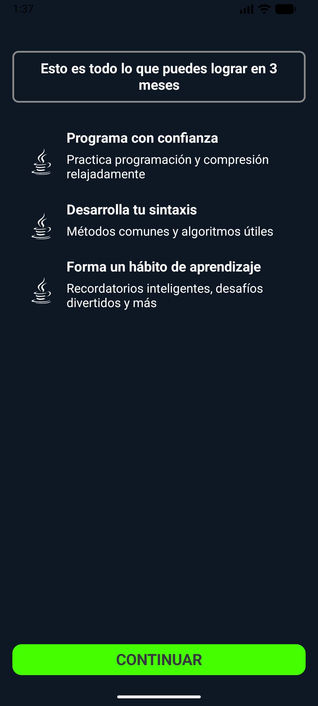
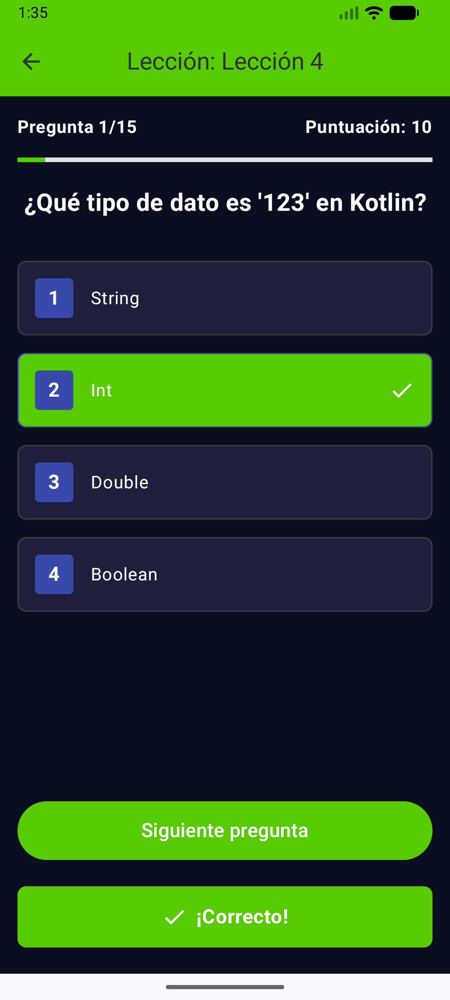

# Programming Learning App 📱

##  Project Description
Mobile learning platform inspired by Duolingo focused on teaching programming concepts through interactive exercises and gamified learning.

The goal of this application is to help beginners learn programming in an engaging and structured way, using lessons, quizzes, and progress tracking.

---

##  Technologies Used
- Android (Java / Kotlin)
- Firebase / SQLite (depending on implementation)
- XML for UI design
- Android Studio

---

##  Main Features
- User registration and login system
- Interactive programming lessons
- Quiz-based exercises
- Progress tracking system
- Gamified learning experience (streaks, scores, levels)
- Simple and intuitive UI

---

##  Key Concepts Applied
- Mobile application development
- User authentication
- UI/UX design principles
- Data persistence
- State management
- Basic software architecture

---

##  Screenshots
Add images of the application here:










---

##  How to Run the Project

1. Clone the repository:
```bash
git clone https://github.com/your-username/duolingo-programming-app.git
